<strong>结论一</strong>： flex-grow的计算方式：

   

<strong>结论二</strong>： flex-shrink的计算方式

   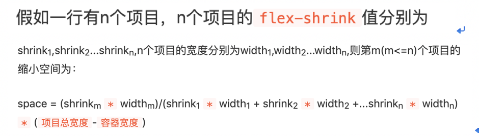

<strong>结论三</strong>： 如果设置了flex-basis，则项目的宽度就是flex-basis。项目总宽度的计算也是基于flex-basis的。

<strong>结论四</strong>：如果项目的宽度（无论是width、还是flex-basis、还是经过flex-grow、flex-shrink后得到的宽度）超过了max-width，或者小于min-width，则以max-width、min-width为准（如果max-width、min-width都设置了，则以min-width为准。就算设置了`!important`也是以min-width为准。）。由此产生的宽度差，按照结论一、结论二的规则分配到其他的项目上。并递归下去。

<i>
<strong>脑洞</strong>：
为什么这flex-grow、flex-shrink计算方式不同？猜测是：
flex-grow的计算方式更加直观，能够让开发者直观知道放大比例。但是，如果flex-shrink也按照flex-grow的方式缩小，则有可能缩小后是负值，这是不允许的，所以才用了现在这种计算方式。
</i>

接下来是验证上述结论。如果不想看就算了趴~反正记住结论就可以了咩~

下面的例子都以如下代码为基准进行修改：

```css
  <style>
    .container {
      display: flex;
      width: 1000px;
      border: 1px solid #000;
    }
    .item-1 {
      background: red;
      color: #fff;
    }

    .item-2 {
      background: green;
      color: #fff;
    }

    .item-3 {
      background: yellow;
      color: #000;
    }
  </style>
```
```html
  <div class="container">
    <div class="item-1">1</div>
    <div class="item-2">2</div>
    <div class="item-3">3</div>
  </div>
```


### 验证结论一
设置flex-grow之前：
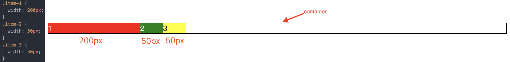

设置flex-grow之后：
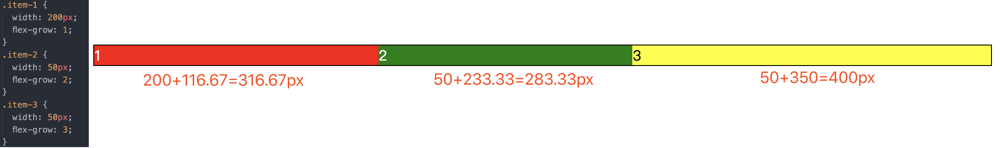

解析：项目总宽度是`200+50+50=300`，而容器宽度是`1000`，剩余空间是`700`，按照结论一的公式，三个项目分别需要增大`1 / (1 + 2 + 3) * 700 = 116.67`，`2 / (1 + 2 + 3) * 700 = 233.33`，`3 / (1 + 2 + 3) * 700 = 350`。最终显示结果如上图所示。

### 验证结论二
flex-shrink均设置为0时，即不缩小时：
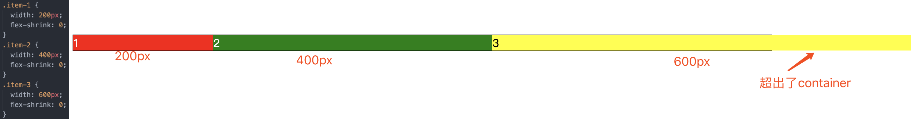

设置flex-shrink之后：
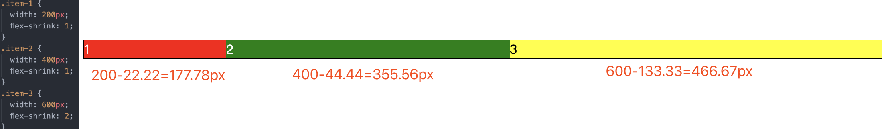

解析：项目总宽度是`200+400+600=1200`，而容器宽度是`1000`，超出的空间是`200`，按照结论二的公式，三个项目分别需要减小`1 * 200 / (1 * 200 + 1 * 400 + 2 * 600) * 200 = 22.22`，`1 * 400 / (1 * 200 + 1 * 400 + 2 * 600) * 200 = 44.44`，`2 * 600 / (1 * 200 + 1 * 400 + 2 * 600) * 200 = 133.33`。最终显示结果如上图所示。


### 验证结论三
同时设置width和flex-basis。

在设置flex-grow之前：
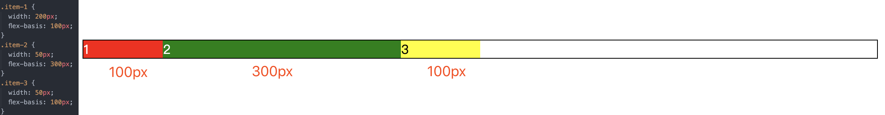

设置flex-grow之后：
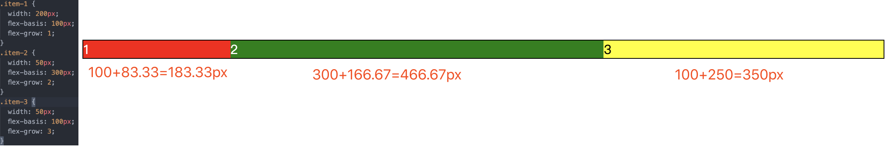

解析：项目总宽度此时应该按照flex-basis计算，即`100+300+100=500`，而容器宽度是`1000`，剩余空间是`500`，按照结论一的公式，三个项目分别需要增大`1 / (1 + 2 + 3) * 500 = 83.33`，`2 / (1 + 2 + 3) * 500 = 166.67`，`3 / (1 + 2 + 3) * 500 = 250`。最终显示结果如上图所示。


### 验证结论四
先说一说设置了max-width的情况。

#### 例子1
在设置max-width之前：


设置了max-width之后：
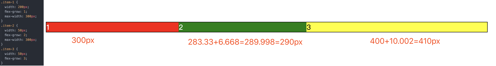

解析：如第一张图所示，在设置max-width之前，三个项目的展示的宽度分别是316.67、283.33、400。而设置了max-width之后，第一个项目的max-width是300，所以根据css规则，第一个项目最终宽度只能是300px。那就多出了316.67-300=16.67px。按照结论四，16.67应该分配到剩下两个项目上，分别分配的空间是：`2 / (2 + 3) * 16.67 = 6.668`，`3 / (2 + 3) * 16.67 = 10.002`。最终显示结果如上面第二个图所示。这个过程经历了两次分配过程。（第一次是根据flex-grow分配，第二次是分配第一个项目多出的空间。）


#### 例子2
那我们再改一下第二个项目的max-width，与例子1不同点在于，项目二的最大宽度小于第一次分配的宽度。

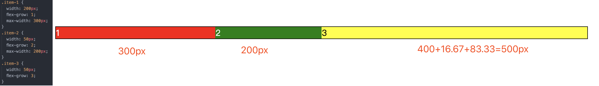

解析：第一个项目多出了316.67-300=16.67px。按照结论四，第二个项目多出了83.33px，多出来的这两部分应该分配到剩下的第三个项目上，第三个项目则多分配：`16.67 + 83.33 = 100`。最终显示结果如上图所示。


#### 例子3
好，那我们再改一下第二个项目的max-width，与例子1、2不同点在于，项目二的最大宽度大于第一次分配的宽度，小于第二次分配的宽度。


解析：如例子1所示，第二个项目第二次分配后宽度是290px，大于最大宽度285px，所以第二个项目只能显示285px，多出的这5px只能分配给第三个项目。


再说一说设置了min-width的情况。

#### 例子4
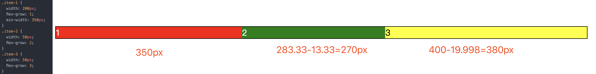

解析：如例子1所示，第一次分配后，第一个项目宽度是316.67px，而min-width是350px，所以额外需要350-16.67=33.33px，这33.33px是需要从另外两个项目得到的。所以另外两个项目分别需要减去一些空间，`2 / (2 + 3) * 33.33 = 13.332`， `3 / (2 + 3) * 33.33 = 19.998`。最终结果如上图所示。


#### 例子5
此时设置flex-shrink，采用验证结论二中的例子：

设置flex-shrink之后：


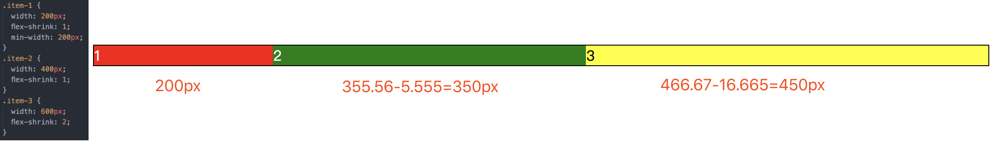

解析：第一次分配后，第一个项目宽度是177.78px，而min-width是200px，所以额外需要200-177.78=22.22px，这22.22px是需要从另外两个项目得到的。所以另外两个项目分别需要减去一些空间，减去空间的计算方式需要遵循结论二，`1 * 400 / (1 * 400 + 2 * 600) * 22.22 = 5.555`， `2 * 600 / (1 * 400 + 2 * 600) * 22.22 = 16.665`。最终结果如上图所示。
